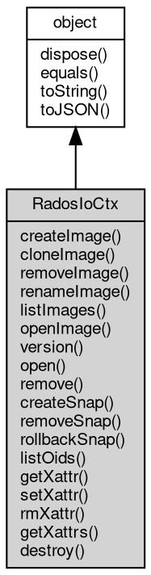

# 对象 RadosIoCtx
[rados](../../module/ifs/rados.md) 集群读写[io](../../module/ifs/io.md)上下文对象，用于打开和关闭kv存储

[rados](../../module/ifs/rados.md)集群读写[io](../../module/ifs/io.md)上下文对象，可使用 [RadosCluster](RadosCluster.md) 对象创建
```
var rados = require('rados');
var cluster = new rados.Rados('clusterName', 'userName', '/path/to/myceph.conf');
cluster.connect();
var io = cluster.createIoCtx('poolName');
var s = io.open('key');
s.write('hello key');
console.log(s.readAll().toString());
```

## 继承关系


## 成员函数
        
### createImage
**创建一个rbd image对象**

```JavaScript
RadosIoCtx.createImage(String name,
    Long size,
    Long stripe_unit = -1,
    Long stripe_count = 1);
```

调用参数:
* name: String, 将要创建镜象的名称
* size: Long, 将要创建镜象的大小
* stripe_unit: Long, 条带大小, 默认值-1代表和单个[object](object.md)大小相同
* stripe_count: Long, 连续写入条带个数, 默认值为1

--------------------------
### cloneImage
**克隆一个rbd image快照到另一个pool中**

```JavaScript
RadosIoCtx.cloneImage(String pName,
    String pSnapshot,
    RadosIoCtx dstio,
    String cName,
    Long stripe_unit = -1,
    Integer stripe_count = 0);
```

调用参数:
* pName: String, 父镜象的名称
* pSnapshot: String, 父镜象的快照名称
* dstio: RadosIoCtx, 目的RadosIoCtx对象, 该对象决定了目的pool
* cName: String, 克隆出的镜像名称
* stripe_unit: Long, 条带大小, 默认值-1代表和单个[object](object.md)大小相同
* stripe_count: Integer, 连续写入条带个数, 默认值为1

--------------------------
### removeImage
**删除一个rbd image对象**

```JavaScript
RadosIoCtx.removeImage(String name);
```

调用参数:
* name: String, 将要删除镜象的名称

--------------------------
### renameImage
**重命名一个rbd image对象**

```JavaScript
RadosIoCtx.renameImage(String src,
    String dst);
```

调用参数:
* src: String, 原rbd image名称
* dst: String, 目的rbd image名称

--------------------------
### listImages
**列出当前pool中所有的镜像名称**

```JavaScript
List RadosIoCtx.listImages();
```

返回结果:
* [List](List.md), 返回的镜像名称列表

--------------------------
### openImage
**打开一个rbd image对象**

```JavaScript
RbdImage RadosIoCtx.openImage(String name,
    String snapshot = "");
```

调用参数:
* name: String, 被打开镜像的名称
* snapshot: String, 被打开镜像的快照名称, 默认没有快照

返回结果:
* [RbdImage](RbdImage.md), 返回一个rbd镜像

--------------------------
### version
**返回librbd c库的版本号**

```JavaScript
String RadosIoCtx.version();
```

返回结果:
* String, 版本号字符串,格式为"major.minor.extra"

--------------------------
### open
**打开一个kv对象**

```JavaScript
RadosStream RadosIoCtx.open(String key);
```

调用参数:
* key: String, 被打开对象的key

返回结果:
* [RadosStream](RadosStream.md), 返回[rados](../../module/ifs/rados.md)对象流

--------------------------
### remove
**删除一个kv对象**

```JavaScript
RadosIoCtx.remove(String key) async;
```

调用参数:
* key: String, 被删除的对象的key

--------------------------
### createSnap
**为一个pool创建一个快照**

```JavaScript
RadosIoCtx.createSnap(String snapname) async;
```

调用参数:
* snapname: String, 创建的快照的名称

--------------------------
### removeSnap
**删除一个快照**

```JavaScript
RadosIoCtx.removeSnap(String snapname) async;
```

调用参数:
* snapname: String, 删除的快照的名称

--------------------------
### rollbackSnap
**回滚某个key到指定的快照的状态**

```JavaScript
RadosIoCtx.rollbackSnap(String oid,
    String snapname) async;
```

调用参数:
* oid: String, 指定的key
* snapname: String, 回滚的快照名称

--------------------------
### listOids
**列出当前pool内所有的key**

```JavaScript
List RadosIoCtx.listOids() async;
```

返回结果:
* [List](List.md), 列出的所有key的列表

--------------------------
**列出当前pool中匹配reg正则表达式的所有key**

```JavaScript
List RadosIoCtx.listOids(String pattern) async;
```

调用参数:
* pattern: String, 为列出的key指定正则

返回结果:
* [List](List.md), 列出的匹配reg的key的列表

--------------------------
### getXattr
**获取指定的key的指定属性值**

```JavaScript
String RadosIoCtx.getXattr(String oid,
    String attr) async;
```

调用参数:
* oid: String, 指定的key
* attr: String, 指定的属性

返回结果:
* String, 获取的属性值

--------------------------
### setXattr
**设置指定key的指定属性的值**

```JavaScript
RadosIoCtx.setXattr(String oid,
    String attr,
    String value) async;
```

调用参数:
* oid: String, 指定的key
* attr: String, 指定的属性
* value: String, 设置的属性的值

--------------------------
### rmXattr
**删除指定key的指定属性**

```JavaScript
RadosIoCtx.rmXattr(String oid,
    String attr) async;
```

调用参数:
* oid: String, 指定的key
* attr: String, 指定的属性

--------------------------
### getXattrs
**获取指定key的所有属性**

```JavaScript
Object RadosIoCtx.getXattrs(String oid) async;
```

调用参数:
* oid: String, 指定的key

返回结果:
* Object, 获取的所有属性的集合, 格式如下

--------------------------
### destroy
**销毁一个[io](../../module/ifs/io.md)上下文**

```JavaScript
RadosIoCtx.destroy() async;
```

--------------------------
### dispose
**强制回收对象，调用此方法后，对象资源将立即释放**

```JavaScript
RadosIoCtx.dispose();
```

--------------------------
### equals
**比较当前对象与给定的对象是否相等**

```JavaScript
Boolean RadosIoCtx.equals(object expected);
```

调用参数:
* expected: [object](object.md), 制定比较的目标对象

返回结果:
* Boolean, 返回对象比较的结果

--------------------------
### toString
**返回对象的字符串表示，一般返回 "[Native Object]"，对象可以根据自己的特性重新实现**

```JavaScript
String RadosIoCtx.toString();
```

返回结果:
* String, 返回对象的字符串表示

--------------------------
### toJSON
**返回对象的 JSON 格式表示，一般返回对象定义的可读属性集合**

```JavaScript
Value RadosIoCtx.toJSON(String key = "");
```

调用参数:
* key: String, 未使用

返回结果:
* Value, 返回包含可 JSON 序列化的值

