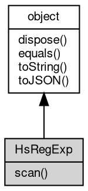

# 对象 HsRegExp
[hyperscan](../../module/ifs/hyperscan.md) 正则搜索对象，用于处理大文本高速正则搜索

HsRegExp 对象属于 [hyperscan](../../module/ifs/hyperscan.md) 模块，创建：

```JavaScript
var reg = hyperscan.compile("hello");
var reg1 = hyperscan.compile(["hello"]);
```

## 继承关系


## 成员函数
        
### scan
**使用[hyperscan](../../module/ifs/hyperscan.md)对文本进行扫描**

```JavaScript
Value HsRegExp.scan(String text);
```

调用参数:
* text: String, 需要扫描的文本

返回结果:
* Value, 返回扫描结果

--------------------------
### dispose
**强制回收对象，调用此方法后，对象资源将立即释放**

```JavaScript
HsRegExp.dispose();
```

--------------------------
### equals
**比较当前对象与给定的对象是否相等**

```JavaScript
Boolean HsRegExp.equals(object expected);
```

调用参数:
* expected: [object](object.md), 制定比较的目标对象

返回结果:
* Boolean, 返回对象比较的结果

--------------------------
### toString
**返回对象的字符串表示，一般返回 "[Native Object]"，对象可以根据自己的特性重新实现**

```JavaScript
String HsRegExp.toString();
```

返回结果:
* String, 返回对象的字符串表示

--------------------------
### toJSON
**返回对象的 JSON 格式表示，一般返回对象定义的可读属性集合**

```JavaScript
Value HsRegExp.toJSON(String key = "");
```

调用参数:
* key: String, 未使用

返回结果:
* Value, 返回包含可 JSON 序列化的值

