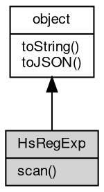

# 对象 HsRegExp
[hyperscan](../../module/ifs/hyperscan.md) 正则搜索对象，用于处理大文本高速正则搜索

HsRegExp 对象属于 [hyperscan](../../module/ifs/hyperscan.md) 模块，创建：

```JavaScript
var reg = hyperscan.compile("hello");
var reg1 = hyperscan.compile(["hello"]);
```

## 继承关系


## 成员函数
        
### scan
**使用[hyperscan](../../module/ifs/hyperscan.md)对二进制buffer进行扫描**

```JavaScript
Value HsRegExp.scan(Buffer buff,
    String codec = "utf8") async;
```

调用参数:
* buff: [Buffer](Buffer.md), 需要扫描的缓冲区
* codec: String, buff的编码格式

返回结果:
* Value, 返回扫描结果。返回扫描结果。未匹配到则返回null, 匹配到返回一个kv对象，其中k为正则字符串，v是一个数组，为匹配到的正则在文本中出现的位置。如[[0, 1]]，第一个元素是[0, 1], 代表该正则匹配到的字符串从位置0开始从位置1结束。数组的长度为1，代表匹配到了一处。如果在编译正则时使用了'H'选项，则匹配到一次后停止。

--------------------------
### toString
**返回对象的字符串表示，一般返回 "[Native Object]"，对象可以根据自己的特性重新实现**

```JavaScript
String HsRegExp.toString();
```

返回结果:
* String, 返回对象的字符串表示

--------------------------
### toJSON
**返回对象的 JSON 格式表示，一般返回对象定义的可读属性集合**

```JavaScript
Value HsRegExp.toJSON(String key = "");
```

调用参数:
* key: String, 未使用

返回结果:
* Value, 返回包含可 JSON 序列化的值

