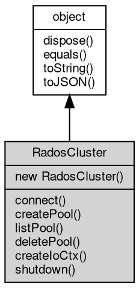

# 对象 RadosCluster
[rados](../../module/ifs/rados.md)集群操作对象，用于创建对[rados](../../module/ifs/rados.md)集群进行读写的ioctx

[rados](../../module/ifs/rados.md)集群对象，用于创建对[rados](../../module/ifs/rados.md)集群进行存取的ioctx对象，可使用 [rados](../../module/ifs/rados.md) 模块创建
```
var rados = require('rados');
var cluster = new rados.Rados('clusterName', 'userName', '/path/to/myceph.conf');
cluster.connect();
var io = cluster.createIoCtx('poolName');
var s = io.open('key');
s.write('hello key');
console.log(s.readAll().toString());
```

## 继承关系


## 构造函数
        
### RadosCluster
**RadosCluster 构造方法, 创建连接[rados](../../module/ifs/rados.md)集群的客户端**

```JavaScript
new RadosCluster(String clusterName,
    String userName,
    String confPath);
```

调用参数:
* clusterName: String, 指定要连接的集群的名称
* userName: String, 指定连接者的用户名
* confPath: String, 指定配置文件路径

## 成员函数
        
### connect
**连接[rados](../../module/ifs/rados.md)服务器集群**

```JavaScript
RadosCluster.connect() async;
```

--------------------------
### createPool
**创建一个pool**

```JavaScript
RadosCluster.createPool(String poolName,
    Long auid = 0,
    Integer crushRule = 0) async;
```

调用参数:
* poolName: String, 新创建的pool的名字
* auid: Long, 新创建的pool的拥有者的id, 默认为0
* crushRule: Integer, 新建的pool的存储规则, 默认为0

--------------------------
### listPool
**列出集群内所有的pool**

```JavaScript
List RadosCluster.listPool() async;
```

返回结果:
* [List](List.md), 集群内所有pool的名称列表

--------------------------
### deletePool
**删除一个pool**

```JavaScript
RadosCluster.deletePool(String poolName) async;
```

调用参数:
* poolName: String, 将要删除的pool的名称

--------------------------
### createIoCtx
**创建一个[io](../../module/ifs/io.md)上下文**

```JavaScript
RadosIoCtx RadosCluster.createIoCtx(String poolName) async;
```

调用参数:
* poolName: String, 指定在poolName 上创建[io](../../module/ifs/io.md)上下文

返回结果:
* [RadosIoCtx](RadosIoCtx.md), 返回[rados](../../module/ifs/rados.md)客户端和服务端连接的上下文

--------------------------
### shutdown
**关闭集群连接**

```JavaScript
RadosCluster.shutdown() async;
```

--------------------------
### dispose
**强制回收对象，调用此方法后，对象资源将立即释放**

```JavaScript
RadosCluster.dispose();
```

--------------------------
### equals
**比较当前对象与给定的对象是否相等**

```JavaScript
Boolean RadosCluster.equals(object expected);
```

调用参数:
* expected: [object](object.md), 制定比较的目标对象

返回结果:
* Boolean, 返回对象比较的结果

--------------------------
### toString
**返回对象的字符串表示，一般返回 "[Native Object]"，对象可以根据自己的特性重新实现**

```JavaScript
String RadosCluster.toString();
```

返回结果:
* String, 返回对象的字符串表示

--------------------------
### toJSON
**返回对象的 JSON 格式表示，一般返回对象定义的可读属性集合**

```JavaScript
Value RadosCluster.toJSON(String key = "");
```

调用参数:
* key: String, 未使用

返回结果:
* Value, 返回包含可 JSON 序列化的值

