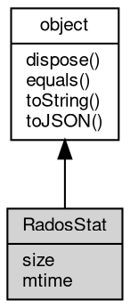

# 对象 RadosStat
[rados](../../module/ifs/rados.md)流状态对象，用于取出流对象大小和最后修改时间

[rados](../../module/ifs/rados.md)流状态对象，用于取出流对象大小和最后修改时间，可使用 [RadosStream](RadosStream.md) 对象创建
```
var rados = require('rados');
var cluster = new rados.Rados('clusterName', 'userName', '/path/to/myceph.conf');
cluster.connect();
var io = cluster.createIoCtx('poolName');
var s = io.open('key');
var stat = s.radosStat();
console.log(stat.size, stat.mtime);
```

## 继承关系


## 成员属性
        
### size
**Long, 查询[rados](../../module/ifs/rados.md)流大小**

```JavaScript
readonly Long RadosStat.size;
```

--------------------------
### mtime
**Date, 查询[rados](../../module/ifs/rados.md)流最后修改时间**

```JavaScript
readonly Date RadosStat.mtime;
```

## 成员函数
        
### dispose
**强制回收对象，调用此方法后，对象资源将立即释放**

```JavaScript
RadosStat.dispose();
```

--------------------------
### equals
**比较当前对象与给定的对象是否相等**

```JavaScript
Boolean RadosStat.equals(object expected);
```

调用参数:
* expected: [object](object.md), 制定比较的目标对象

返回结果:
* Boolean, 返回对象比较的结果

--------------------------
### toString
**返回对象的字符串表示，一般返回 "[Native Object]"，对象可以根据自己的特性重新实现**

```JavaScript
String RadosStat.toString();
```

返回结果:
* String, 返回对象的字符串表示

--------------------------
### toJSON
**返回对象的 JSON 格式表示，一般返回对象定义的可读属性集合**

```JavaScript
Value RadosStat.toJSON(String key = "");
```

调用参数:
* key: String, 未使用

返回结果:
* Value, 返回包含可 JSON 序列化的值

