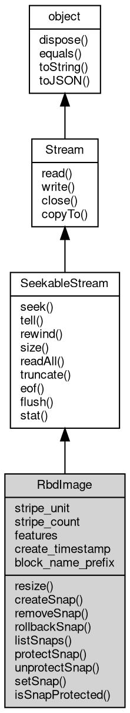

# 对象 RbdImage
rbd image对象，用于读写rbd image

rbd image对象,用于对rbd image进行操作，可使用 [RadosIoCtx](RadosIoCtx.md) 对象创建
```
var rados = require('rados');
var cluster = new rados.Rados('clusterName', 'userName', '/path/to/myceph.conf');
cluster.connect();
var io = cluster.createIoCtx('poolName');
io.createImage("myImage");
var image = io.openImage('myImage');
image.write('hello key');
console.log(image.readAll().toString());
```

## 继承关系


## 成员属性
        
### stripe_unit
**Long, 查询条纹大小**

```JavaScript
readonly Long RbdImage.stripe_unit;
```

--------------------------
### stripe_count
**Long, 查询连续写入条纹个数**

```JavaScript
readonly Long RbdImage.stripe_count;
```

--------------------------
### features
**Long, 查询镜像的feature**

```JavaScript
readonly Long RbdImage.features;
```

--------------------------
### create_timestamp
**Date, 查询镜像的feature**

```JavaScript
readonly Date RbdImage.create_timestamp;
```

--------------------------
### block_name_prefix
**String, 查询镜像在pool中全称的前缀**

```JavaScript
readonly String RbdImage.block_name_prefix;
```

## 成员函数
        
### resize
**修改rbd image大小**

```JavaScript
RbdImage.resize(Long bytes) async;
```

调用参数:
* bytes: Long, 修改后的大小

--------------------------
### createSnap
**为一个rbd镜像创建一个快照**

```JavaScript
RbdImage.createSnap(String snapname) async;
```

调用参数:
* snapname: String, 将要创建的快照名称

--------------------------
### removeSnap
**移除一个rbd镜像的快照**

```JavaScript
RbdImage.removeSnap(String snapname) async;
```

调用参数:
* snapname: String, 将要移除的快照的名称

--------------------------
### rollbackSnap
**回滚到一个rbd镜像的快照**

```JavaScript
RbdImage.rollbackSnap(String snapname) async;
```

调用参数:
* snapname: String, 将要回滚到的快照的名称

--------------------------
### listSnaps
**列举一个rbd镜像的所有快照**

```JavaScript
List RbdImage.listSnaps() async;
```

返回结果:
* [List](List.md), 包含所有快照名称的列表

--------------------------
### protectSnap
**保护一个rbd镜像的快照以防快照被删除**

```JavaScript
RbdImage.protectSnap(String snapname) async;
```

调用参数:
* snapname: String, 将要被保护的快照的名称

--------------------------
### unprotectSnap
**取消对一个rbd镜像的保护,允许其被删除**

```JavaScript
RbdImage.unprotectSnap(String snapname) async;
```

调用参数:
* snapname: String, 将要取消保护的快照的名称

--------------------------
### setSnap
**设置一个rbd镜像的快照为只读**

```JavaScript
RbdImage.setSnap(String snapname = "") async;
```

调用参数:
* snapname: String, 将要设置的快照名称。默认为空，用以取消对快照为只读

--------------------------
### isSnapProtected
**判断一个快照是否是不可删除的**

```JavaScript
Boolean RbdImage.isSnapProtected(String snapname) async;
```

调用参数:
* snapname: String, 快照名称

返回结果:
* Boolean, true代表不可删除，false代表可以删除

--------------------------
### seek
**移动文件当前操作位置**

```JavaScript
RbdImage.seek(Long offset,
    Integer whence);
```

调用参数:
* offset: Long, 指定新的位置
* whence: Integer, 指定位置基准，允许的值为：SEEK_SET, SEEK_CUR, SEEK_END

--------------------------
### tell
**查询流当前位置**

```JavaScript
Long RbdImage.tell();
```

返回结果:
* Long, 返回流当前位置

--------------------------
### rewind
**移动当前位置到流开头**

```JavaScript
RbdImage.rewind();
```

--------------------------
### size
**查询流尺寸**

```JavaScript
Long RbdImage.size();
```

返回结果:
* Long, 返回流尺寸

--------------------------
### readAll
**从流内读取剩余的全部数据**

```JavaScript
Buffer RbdImage.readAll() async;
```

返回结果:
* [Buffer](Buffer.md), 返回从流内读取的数据，若无数据可读，或者连接中断，则返回 null

--------------------------
### truncate
**修改文件尺寸，如果新尺寸小于原尺寸，则文件被截断**

```JavaScript
RbdImage.truncate(Long bytes) async;
```

调用参数:
* bytes: Long, 新的文件尺寸

--------------------------
### eof
**查询文件是否到结尾**

```JavaScript
Boolean RbdImage.eof();
```

返回结果:
* Boolean, 返回 True 表示结尾

--------------------------
### flush
**将文件缓冲区内容写入物理设备**

```JavaScript
RbdImage.flush() async;
```

--------------------------
### stat
**查询当前文件的基础信息**

```JavaScript
Stat RbdImage.stat() async;
```

返回结果:
* [Stat](Stat.md), 返回 [Stat](Stat.md) 对象描述文件信息

--------------------------
### read
**从流内读取指定大小的数据**

```JavaScript
Buffer RbdImage.read(Integer bytes = -1) async;
```

调用参数:
* bytes: Integer, 指定要读取的数据量，缺省为读取随机大小的数据块，读出的数据尺寸取决于设备

返回结果:
* [Buffer](Buffer.md), 返回从流内读取的数据，若无数据可读，或者连接中断，则返回 null

--------------------------
### write
**将给定的数据写入流**

```JavaScript
RbdImage.write(Buffer data) async;
```

调用参数:
* data: [Buffer](Buffer.md), 给定要写入的数据

--------------------------
### close
**关闭当前流对象**

```JavaScript
RbdImage.close() async;
```

--------------------------
### copyTo
**复制流数据到目标流中**

```JavaScript
Long RbdImage.copyTo(Stream stm,
    Long bytes = -1) async;
```

调用参数:
* stm: [Stream](Stream.md), 目标流对象
* bytes: Long, 复制的字节数

返回结果:
* Long, 返回复制的字节数

--------------------------
### dispose
**强制回收对象，调用此方法后，对象资源将立即释放**

```JavaScript
RbdImage.dispose();
```

--------------------------
### equals
**比较当前对象与给定的对象是否相等**

```JavaScript
Boolean RbdImage.equals(object expected);
```

调用参数:
* expected: [object](object.md), 制定比较的目标对象

返回结果:
* Boolean, 返回对象比较的结果

--------------------------
### toString
**返回对象的字符串表示，一般返回 "[Native Object]"，对象可以根据自己的特性重新实现**

```JavaScript
String RbdImage.toString();
```

返回结果:
* String, 返回对象的字符串表示

--------------------------
### toJSON
**返回对象的 JSON 格式表示，一般返回对象定义的可读属性集合**

```JavaScript
Value RbdImage.toJSON(String key = "");
```

调用参数:
* key: String, 未使用

返回结果:
* Value, 返回包含可 JSON 序列化的值

